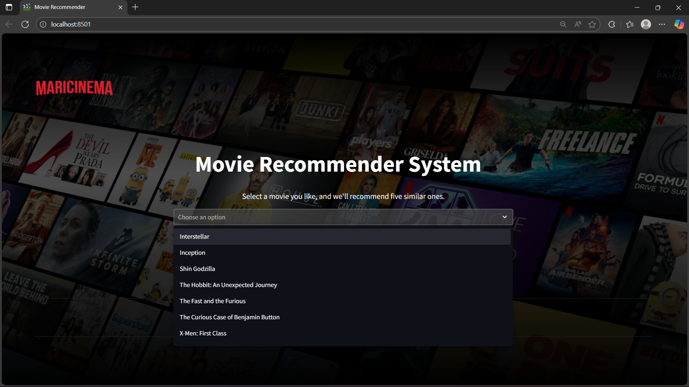
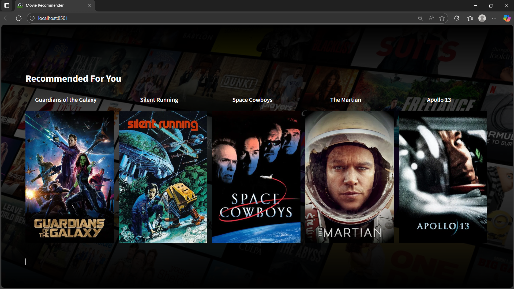

# 🎬 Movie Recommender System (ML Project)

A machine learning based **Movie Recommender System** that suggests movies similar to the one selected by the user.
This project demonstrates the full ML workflow — from **data cleaning** and **preprocessing**, to building a **content-based recommendation model**, and finally **deploying it as a web app** using **Streamlit** and **ngrok**.

**Created by: Nitish**

---

## 📌 Features

* ✅ Data cleaning & preprocessing on raw dataset
* ✅ Content-based recommendation system using cosine similarity
* ✅ Pickle files (`.pkl`) used to transfer model & data between Jupyter Notebook and PyCharm
* ✅ Interactive website built using **Streamlit**
* ✅ **TMDB API integration** for real movie posters
* ✅ **Caching system** for optimal performance
* ✅ **Search functionality** for easy movie selection
* ✅ **Error handling** and fallback mechanisms

---

## 📂 Repository Structure

```
├── Movie-Recommendor-system.ipynb   # Notebook: data cleaning, preprocessing, model building
├── movie_dict.pkl                   # Dictionary mapping movie titles to metadata
├── similarity.pkl                   # Precomputed similarity matrix (Git LFS)
├── generate_similarity.py           # Script to regenerate similarity.pkl
├── app.py                           # Streamlit web application
├── requirements.txt                 # Dependencies
├── MARICINEMA.png                   # Logo image
├── MARICINEMA_BACKGROUND.jpg        # Background image
├── IMAGE_INPUT.png                  # Input interface screenshot
└── IMAGE_OUTPUT.png                 # Output recommendations screenshot
```

---

## ⚙️ Installation & Setup

1. Clone the repository

   ```bash
   git clone <your-github-repo-url>
   cd Movie-Recommender-System-ML-Project
   ```

2. Install dependencies

   ```bash
   pip install -r requirements.txt
   ```

   **Note:** This repository uses Git LFS for large files. If you don't have Git LFS installed, install it from [git-lfs.github.io](https://git-lfs.github.io/) or run:
   ```bash
   git lfs install
   ```

3. Run the Streamlit app (similarity.pkl is already included)

   ```bash
   streamlit run app.py
   ```

4. (Optional) Get TMDB API key for real movie posters

   - Go to [TMDB API](https://www.themoviedb.org/settings/api)
   - Create an account and request an API key
   - The app uses a built-in API key, but you can replace it in `app.py` if needed

---


## 🚀 How It Works

1. **Data Cleaning & Preprocessing**

   * Removed null values, duplicates, and unnecessary columns
   * Transformed text data (genres, tags, etc.) into numerical form

2. **Model Training (Content-Based)**

   * Used **cosine similarity** to find movies similar to the input
   * Stored processed features in `movie_dict.pkl` and `similarity.pkl`

3. **Pickle Transfer**

   * Saved trained data into `.pkl` files in Jupyter Notebook
   * Loaded them into the Streamlit app for real-time recommendations

4. **Deployment**

   * Built web interface using **Streamlit**
   * Deployed locally & shared via **ngrok**

---

## 🎥 Screenshots

Here are some snapshots of the **Streamlit web app** showing the input interface and movie recommendations:

| Input Interface                 | Recommendation Results                  |
| ------------------------------- | --------------------------------------- |
|  |  |

---

## 📌 More About This Project

* This project highlights **end-to-end ML skills** — from raw data to deployment.
* It focuses on **content-based recommendations**, but can be extended to **collaborative filtering** or **hybrid systems**.
* Aimed at showcasing practical application of ML in **real-world scenarios** (personalized recommendations).
* Built with tools and workflows commonly used in industry (Jupyter, PyCharm, pickle, Streamlit, ngrok).

---


## 🔗 Connect With Me

* 🌐 GitHub: [https://github.com/NitishRH07]
* 💼 LinkedIn: [https://www.linkedin.com/in/nitish-r-honnali-798442327/]

---

**Project by: Nitish**
